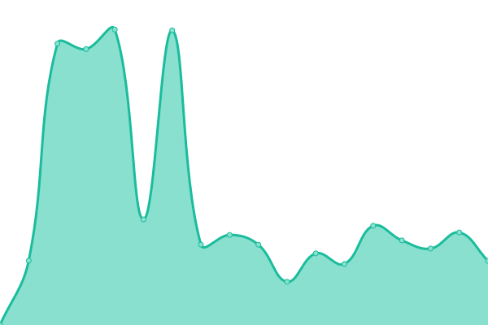

# [📈 Live Status](https://status.pysio.online): <!--live status--> **🟩 All systems operational**

This repository contains the open-source uptime monitor and status page for [Pysio](https://www.pysio.online/), powered by [Upptime](https://github.com/upptime/upptime).

With [Upptime](https://upptime.js.org), you can get your own unlimited and free uptime monitor and status page, powered entirely by a GitHub repository. We use [Issues](https://github.com/pysio2007/upptime/issues) as incident reports, [Actions](https://github.com/pysio2007/upptime/actions) as uptime monitors, and [Pages](https://status.pysio.online) for the status page.

<!--start: status pages-->
<!-- This summary is generated by Upptime (https://github.com/upptime/upptime) -->
<!-- Do not edit this manually, your changes will be overwritten -->
<!-- prettier-ignore -->
| URL | Status | History | Response Time | Uptime |
| --- | ------ | ------- | ------------- | ------ |
|  [Pysio's Home](https://www.pysio.online/) | 🟩 Up | [pysio-s-home.yml](https://github.com/pysio2007/upptime/commits/HEAD/history/pysio-s-home.yml) | 

 151ms
     
 | 

<a href="https://status.pysio.online/history/pysio-s-home">100.00%</a>
    

|  [Pysio Home Files](https://files.pysio.online/files/Pysio-Imges/20241005215409.png) | 🟩 Up | [pysio-home-files.yml](https://github.com/pysio2007/upptime/commits/HEAD/history/pysio-home-files.yml) | 

 233ms
     
 | 

<a href="https://status.pysio.online/history/pysio-home-files">100.00%</a>
    

|  [Blog Api](https://blogapi.pysio.online/) | 🟩 Up | [blog-api.yml](https://github.com/pysio2007/upptime/commits/HEAD/history/blog-api.yml) | 

 641ms
     
 | 

<a href="https://status.pysio.online/history/blog-api">100.00%</a>
    

|  [Bitwarden](https://bitwarden.pysio.online/) | 🟩 Up | [bitwarden.yml](https://github.com/pysio2007/upptime/commits/HEAD/history/bitwarden.yml) | 

 155ms
     
 | 

<a href="https://status.pysio.online/history/bitwarden">100.00%</a>
    

|  [Random Image Api](https://randomimg.pysio.online/output/123871517_p0_master1200.webp) | 🟩 Up | [random-image-api.yml](https://github.com/pysio2007/upptime/commits/HEAD/history/random-image-api.yml) | 

 83ms
     
 | 

<a href="https://status.pysio.online/history/random-image-api">100.00%</a>
    

|  [DoH (China)](https://doh.pysio.online/) | 🟩 Up | [do-h-china.yml](https://github.com/pysio2007/upptime/commits/HEAD/history/do-h-china.yml) | 

 717ms
     
 | 

<a href="https://status.pysio.online/history/do-h-china">100.00%</a>
    

|  [DoH (Global)](https://dohk.pysio.online/) | 🟩 Up | [do-h-global.yml](https://github.com/pysio2007/upptime/commits/HEAD/history/do-h-global.yml) | 

 943ms
     
 | 

<a href="https://status.pysio.online/history/do-h-global">100.00%</a>
    

|  [Pysio-HomeLab](home.pysio.online) | 🟩 Up | [pysio-home-lab.yml](https://github.com/pysio2007/upptime/commits/HEAD/history/pysio-home-lab.yml) | 

 238ms
     
 | 

<a href="https://status.pysio.online/history/pysio-home-lab">100.00%</a>
    

|  [Pysio-SG-DN42](dn42.pysio.online) | 🟩 Up | [pysio-sg-dn-42.yml](https://github.com/pysio2007/upptime/commits/HEAD/history/pysio-sg-dn-42.yml) | 

 209ms
     
 | 

<a href="https://status.pysio.online/history/pysio-sg-dn-42">100.00%</a>
    

|  [Pysio-IPV6-BGP](bgp.pysio.online) | 🟩 Up | [pysio-ipv-6-bgp.yml](https://github.com/pysio2007/upptime/commits/HEAD/history/pysio-ipv-6-bgp.yml) | 

 112ms
     
 | 

<a href="https://status.pysio.online/history/pysio-ipv-6-bgp">100.00%</a>
    

|  [Pysio-Home-BGP](home.pysio.online) | 🟩 Up | [pysio-home-bgp.yml](https://github.com/pysio2007/upptime/commits/HEAD/history/pysio-home-bgp.yml) | 

 244ms
     
 | 

<a href="https://status.pysio.online/history/pysio-home-bgp">100.00%</a>
    

|  [Cat Blog](https://blog.starair.ltd/) | 🟩 Up | [cat-blog.yml](https://github.com/pysio2007/upptime/commits/HEAD/history/cat-blog.yml) | 

 1875ms
     
 | 

<a href="https://status.pysio.online/history/cat-blog">100.00%</a>
    

|  [Cat RandomAPI](https://api.starair.ltd/randomImage?requestType=redirect) | 🟩 Up | [cat-random-api.yml](https://github.com/pysio2007/upptime/commits/HEAD/history/cat-random-api.yml) | 

 1636ms
     
 | 

<a href="https://status.pysio.online/history/cat-random-api">100.00%</a>
    

<!--end: status pages-->

[**Visit our status website →**](https://status.pysio.online)

## 📄 License

- Powered by: [Upptime](https://github.com/upptime/upptime)
- Code: [MIT](./LICENSE) © [Anand Chowdhary](https://anandchowdhary.com), supported by [Pabio](https://pabio.com)
- Data in the `./history` directory: [Open Database License](https://opendatacommons.org/licenses/odbl/1-0/)
