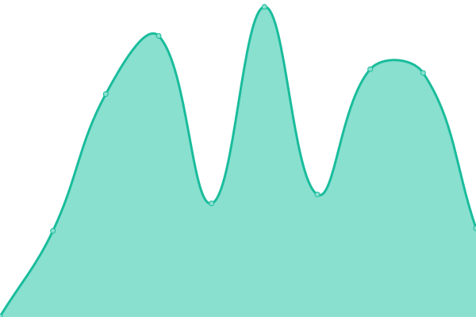

# [📈 Live Status](https://status.pysio.online): <!--live status--> **🟩 All systems operational**

This repository contains the open-source uptime monitor and status page for [Pysio](https://www.pysio.online/), powered by [Upptime](https://github.com/upptime/upptime).

With [Upptime](https://upptime.js.org), you can get your own unlimited and free uptime monitor and status page, powered entirely by a GitHub repository. We use [Issues](https://github.com/pysio2007/upptime/issues) as incident reports, [Actions](https://github.com/pysio2007/upptime/actions) as uptime monitors, and [Pages](https://status.pysio.online) for the status page.

<!--start: status pages-->
<!-- This summary is generated by Upptime (https://github.com/upptime/upptime) -->
<!-- Do not edit this manually, your changes will be overwritten -->
<!-- prettier-ignore -->
| URL | Status | History | Response Time | Uptime |
| --- | ------ | ------- | ------------- | ------ |
|  [Pysio's Home](https://www.pysio.online/sitemap.xml) | 🟩 Up | [pysio-s-home.yml](https://github.com/pysio2007/upptime/commits/HEAD/history/pysio-s-home.yml) | 

 199ms
     
 | 

<a href="https://status.pysio.online/history/pysio-s-home">100.00%</a>
    

|  [Pysio Home Files](https://files.pysio.online/Avatar/z0z0r4.jpg) | 🟩 Up | [pysio-home-files.yml](https://github.com/pysio2007/upptime/commits/HEAD/history/pysio-home-files.yml) | 

 362ms
     
 | 

<a href="https://status.pysio.online/history/pysio-home-files">100.00%</a>
    

|  [Blog Api](https://blogapi.pysio.online/) | 🟩 Up | [blog-api.yml](https://github.com/pysio2007/upptime/commits/HEAD/history/blog-api.yml) | 

 691ms
     
 | 

<a href="https://status.pysio.online/history/blog-api">100.00%</a>
    

|  [Bitwarden](https://bitwarden.pysio.online/) | 🟩 Up | [bitwarden.yml](https://github.com/pysio2007/upptime/commits/HEAD/history/bitwarden.yml) | 

 279ms
     
 | 

<a href="https://status.pysio.online/history/bitwarden">100.00%</a>
    

|  [AnyCast WebSite](http://anycast.ink/) | 🟩 Up | [any-cast-web-site.yml](https://github.com/pysio2007/upptime/commits/HEAD/history/any-cast-web-site.yml) | 

 3330ms
     
 | 

<a href="https://status.pysio.online/history/any-cast-web-site">99.85%</a>
    

|  [Looking Glass WebSite](http://lg.pysio.online/) | 🟩 Up | [looking-glass-web-site.yml](https://github.com/pysio2007/upptime/commits/HEAD/history/looking-glass-web-site.yml) | 

 2004ms
     
 | 

<a href="https://status.pysio.online/history/looking-glass-web-site">100.00%</a>
    

|  [Random Image Api](https://blogapi.pysio.online/random_image) | 🟩 Up | [random-image-api.yml](https://github.com/pysio2007/upptime/commits/HEAD/history/random-image-api.yml) | 

 1603ms
     
 | 

<a href="https://status.pysio.online/history/random-image-api">100.00%</a>
    

|  [Minio](https://minio.pysio.online/) | 🟩 Up | [minio.yml](https://github.com/pysio2007/upptime/commits/HEAD/history/minio.yml) | 

 283ms
     
 | 

<a href="https://status.pysio.online/history/minio">100.00%</a>
    

|  [Minio-API](https://minioapi.pysio.online/randomimg/02e742e30d5ea4cb4a91a93b0b3ad17b.webp) | 🟩 Up | [minio-api.yml](https://github.com/pysio2007/upptime/commits/HEAD/history/minio-api.yml) | 

 31ms
     
 | 

<a href="https://status.pysio.online/history/minio-api">100.00%</a>
    

|  [权威 DNS](https://dns.pysio.online/) | 🟩 Up | [dns.yml](https://github.com/pysio2007/upptime/commits/HEAD/history/dns.yml) | 

 420ms
     
 | 

<a href="https://status.pysio.online/history/dns">100.00%</a>
    

|  [DoH (China)](https://doh.pysio.online/) | 🟩 Up | [do-h-china.yml](https://github.com/pysio2007/upptime/commits/HEAD/history/do-h-china.yml) | 

 782ms
     
 | 

<a href="https://status.pysio.online/history/do-h-china">100.00%</a>
    

|  [PLEX](https://plex.pysio.online/web/index.html#!/) | 🟩 Up | [plex.yml](https://github.com/pysio2007/upptime/commits/HEAD/history/plex.yml) | 

 3315ms
     
 | 

<a href="https://status.pysio.online/history/plex">99.46%</a>
    

|  [Immich](https://immich.pysio.online) | 🟩 Up | [immich.yml](https://github.com/pysio2007/upptime/commits/HEAD/history/immich.yml) | 

 1555ms
     
 | 

<a href="https://status.pysio.online/history/immich">99.47%</a>
    

|  [JumpServer](https://js.pysio.online) | 🟩 Up | [jump-server.yml](https://github.com/pysio2007/upptime/commits/HEAD/history/jump-server.yml) | 

 1136ms
     
 | 

<a href="https://status.pysio.online/history/jump-server">100.00%</a>
    

|  [PysioHome-PVE](https://pve.pysio.online) | 🟩 Up | [pysio-home-pve.yml](https://github.com/pysio2007/upptime/commits/HEAD/history/pysio-home-pve.yml) | 

 2500ms
     
 | 

<a href="https://status.pysio.online/history/pysio-home-pve">99.48%</a>
    

|  [RPKI-Clearnet](23.82.99.185) | 🟩 Up | [rpki-clearnet.yml](https://github.com/pysio2007/upptime/commits/HEAD/history/rpki-clearnet.yml) | 

 46ms
     
 | 

<a href="https://status.pysio.online/history/rpki-clearnet">100.00%</a>
    

|  [RPKI-DN42](23.82.99.185) | 🟩 Up | [rpki-dn-42.yml](https://github.com/pysio2007/upptime/commits/HEAD/history/rpki-dn-42.yml) | 

 46ms
     
 | 

<a href="https://status.pysio.online/history/rpki-dn-42">100.00%</a>
    

|  [MCIM-root](https://mod.mcimirror.top) | 🟩 Up | [mcim-root.yml](https://github.com/pysio2007/upptime/commits/HEAD/history/mcim-root.yml) | 

 378ms
     
 | 

<a href="https://status.pysio.online/history/mcim-root">81.68%</a>
    

|  [MCIM-docs](https://mod.mcimirror.top/docs) | 🟩 Up | [mcim-docs.yml](https://github.com/pysio2007/upptime/commits/HEAD/history/mcim-docs.yml) | 

 2079ms
     
 | 

<a href="https://status.pysio.online/history/mcim-docs">81.69%</a>
    

|  [MCIM-Curseforge Search](https://mod.mcimirror.top/curseforge/v1/mods/search?gameId=432&pageSize=50) | 🟩 Up | [mcim-curseforge-search.yml](https://github.com/pysio2007/upptime/commits/HEAD/history/mcim-curseforge-search.yml) | 

 2663ms
     
 | 

<a href="https://status.pysio.online/history/mcim-curseforge-search">91.45%</a>
    

|  [MCIM-Curseforge Mod](https://mod.mcimirror.top/curseforge/v1/mods/238222) | 🟩 Up | [mcim-curseforge-mod.yml](https://github.com/pysio2007/upptime/commits/HEAD/history/mcim-curseforge-mod.yml) | 

 406ms
     
 | 

<a href="https://status.pysio.online/history/mcim-curseforge-mod">91.74%</a>
    

|  [MCIM-Curseforge Single File](https://mod.mcimirror.top/curseforge/v1/mods/256717/files/2666198) | 🟩 Up | [mcim-curseforge-single-file.yml](https://github.com/pysio2007/upptime/commits/HEAD/history/mcim-curseforge-single-file.yml) | 

 1731ms
     
 | 

<a href="https://status.pysio.online/history/mcim-curseforge-single-file">91.61%</a>
    

|  [MCIM-Curseforge Files](https://mod.mcimirror.top/curseforge/v1/mods/238222/files) | 🟩 Up | [mcim-curseforge-files.yml](https://github.com/pysio2007/upptime/commits/HEAD/history/mcim-curseforge-files.yml) | 

 774ms
     
 | 

<a href="https://status.pysio.online/history/mcim-curseforge-files">91.90%</a>
    

|  [MCIM-Curseforge Fingerprints](https://mod.mcimirror.top/curseforge/v1/fingerprints) | 🟩 Up | [mcim-curseforge-fingerprints.yml](https://github.com/pysio2007/upptime/commits/HEAD/history/mcim-curseforge-fingerprints.yml) | 

 2568ms
     
 | 

<a href="https://status.pysio.online/history/mcim-curseforge-fingerprints">92.97%</a>
    

|  [MCIM-Curseforge Fingerprints 432](https://mod.mcimirror.top/curseforge/v1/fingerprints/432) | 🟩 Up | [mcim-curseforge-fingerprints-432.yml](https://github.com/pysio2007/upptime/commits/HEAD/history/mcim-curseforge-fingerprints-432.yml) | 

 1359ms
     
 | 

<a href="https://status.pysio.online/history/mcim-curseforge-fingerprints-432">93.12%</a>
    

|  [MCIM-Modrinth Search](https://mod.mcimirror.top/modrinth/v2/search?offset=0&limit=10&index=relevance) | 🟩 Up | [mcim-modrinth-search.yml](https://github.com/pysio2007/upptime/commits/HEAD/history/mcim-modrinth-search.yml) | 

 641ms
     
 | 

<a href="https://status.pysio.online/history/mcim-modrinth-search">90.79%</a>
    

|  [MCIM-Modrinth Project](https://mod.mcimirror.top/modrinth/v2/project/sodium-extra) | 🟩 Up | [mcim-modrinth-project.yml](https://github.com/pysio2007/upptime/commits/HEAD/history/mcim-modrinth-project.yml) | 

 1383ms
     
 | 

<a href="https://status.pysio.online/history/mcim-modrinth-project">91.98%</a>
    

|  [MCIM-Modrinth Versions](https://mod.mcimirror.top/modrinth/v2/project/sodium-extra/version) | 🟩 Up | [mcim-modrinth-versions.yml](https://github.com/pysio2007/upptime/commits/HEAD/history/mcim-modrinth-versions.yml) | 

 952ms
     
 | 

<a href="https://status.pysio.online/history/mcim-modrinth-versions">91.61%</a>
    

|  [MCIM-Modrinth Single Version](https://mod.mcimirror.top/modrinth/v2/version/3JJvf9Kn) | 🟩 Up | [mcim-modrinth-single-version.yml](https://github.com/pysio2007/upptime/commits/HEAD/history/mcim-modrinth-single-version.yml) | 

 1383ms
     
 | 

<a href="https://status.pysio.online/history/mcim-modrinth-single-version">91.99%</a>
    

|  [MCIM-Modrinth hash](https://mod.mcimirror.top/modrinth/v2/version_file/acac3670ee25cc10ed63136e5dd3b792acd13595?algorithm=sha1) | 🟩 Up | [mcim-modrinth-hash.yml](https://github.com/pysio2007/upptime/commits/HEAD/history/mcim-modrinth-hash.yml) | 

 421ms
     
 | 

<a href="https://status.pysio.online/history/mcim-modrinth-hash">91.99%</a>
    

|  [MCIM-Modrinth Single File Update](https://mod.mcimirror.top/modrinth/v2/version_file/3257d1fe02c9f7710feec955d4e91bd1de69bbe930a3779602ea7c78920ca1f9cef3c4450158cabaddc330d2d4a96a2558d8f136c770b2657886797f2452eb24/update?algorithm=sha512) | 🟩 Up | [mcim-modrinth-single-file-update.yml](https://github.com/pysio2007/upptime/commits/HEAD/history/mcim-modrinth-single-file-update.yml) | 

 3697ms
     
 | 

<a href="https://status.pysio.online/history/mcim-modrinth-single-file-update">91.99%</a>
    

|  [MCIM-Modrinth Files Update](https://mod.mcimirror.top/modrinth/v2/version_files/update) | 🟩 Up | [mcim-modrinth-files-update.yml](https://github.com/pysio2007/upptime/commits/HEAD/history/mcim-modrinth-files-update.yml) | 

 2309ms
     
 | 

<a href="https://status.pysio.online/history/mcim-modrinth-files-update">91.99%</a>
    

|  [MCIM-Modrinth file cdn](https://mod.mcimirror.top/data/P7dR8mSH/versions/Y0cpssyN/fabric-api-0.100.6%2B1.21.jar) | 🟩 Up | [mcim-modrinth-file-cdn.yml](https://github.com/pysio2007/upptime/commits/HEAD/history/mcim-modrinth-file-cdn.yml) | 

 432ms
     
 | 

<a href="https://status.pysio.online/history/mcim-modrinth-file-cdn">91.63%</a>
    

|  [MCIM-Curseforge file cdn](https://mod.mcimirror.top/files/5106/178/jei-1.19.2-forge-11.6.0.1019.jar) | 🟩 Up | [mcim-curseforge-file-cdn.yml](https://github.com/pysio2007/upptime/commits/HEAD/history/mcim-curseforge-file-cdn.yml) | 

 425ms
     
 | 

<a href="https://status.pysio.online/history/mcim-curseforge-file-cdn">91.63%</a>
    

<!--end: status pages-->

[**Visit our status website →**](https://status.pysio.online)

## 📄 License

- Powered by: [Upptime](https://github.com/upptime/upptime)
- Code: [MIT](./LICENSE) © [Anand Chowdhary](https://anandchowdhary.com), supported by [Pabio](https://pabio.com)
- Data in the `./history` directory: [Open Database License](https://opendatacommons.org/licenses/odbl/1-0/)
